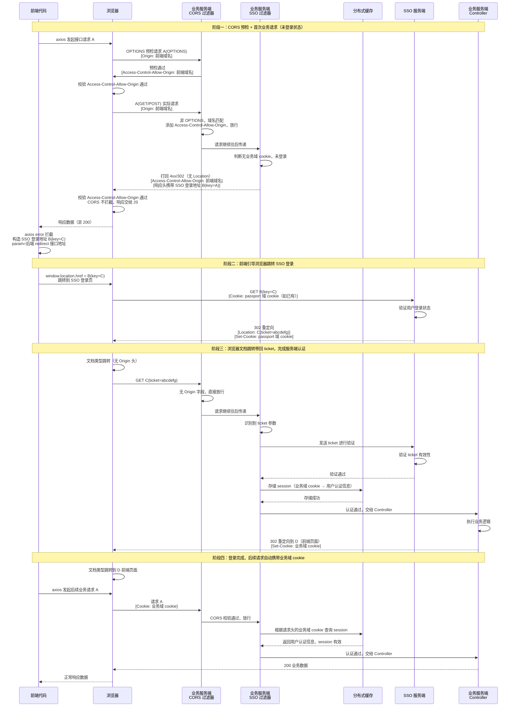

# knl-auth-sso

这篇文章是讲解了实际业务开发中，接入 SSO 的整体的流程，以及其中部分细节的讲解

前端使用 vue + axios 举例

后端使用诸如 java + springboot 等技术栈举例

## 简介

SSO 是单点登录，即用户在登录一个系统后，无需再登录其他系统，即可访问其他系统的资源。简单说就是一般企业内部的所有 web 站点都搞一个鉴权，比如登录企业内部的 A 站点后，你再访问内部的 B 站点的页面，就无须再去做登录了，一般这种 SSO 单点登录在企业的内部系统非常常见

## 前置知识讲解

### 关于 cors 的介绍
cors 跨域，是浏览器的安全策略，W3C标准化规范。所有现代浏览器（Chrome、Firefox、Safari、Edge等）均原生支持

跨域的表现：
当一个 axios 请求，如果请求的协议(http/https)，或者域名，或者端口，和当前前端项目不一致时（任意一个不一致），就会存在跨域问题，表现为请求在 chrome 调试中看到发了，Network 面板仍可见响应内容，但是前端拿不到响应内容，浏览器会报错显示 cors 问题

跨域一般怎么处理：
跨域在生产上，一般都是需要后端加上配置，比如 springboot 项目加上 cors 的过滤器配置，过滤器中需要指明允许某些域名的前端来发起访问，如果不加前端对应的域名，那么浏览器在接收到业务后端的数据后就被拦截了，然后不展现给前端

跨域处理后的请求过程：
axios 发送跨域的请求，header 会被浏览器自动加上 Origin: 域名:端口，然后请求打到后端过滤器，检查 Origin，若和过滤器中配置的允许源一致，则加上 Access-Control-Allow-Origin 响应头，然后，后端业务代码再被请求，并且返回给浏览器，浏览器识别到响应头后就放行给前端代码了

浏览器为什么要有跨域这个安全策略：
cors 是浏览器的安全策略，它的初衷就是为了保护用户的安全，形式上看着就像是给服务端的数据的安全性做兜底。当前端域名若和 axios 请求的服务端域名不一致时，浏览器默认认为此次获取数据是不安全的，默认需要进行跨域拦截来阻止数据展现，除非后端加了 cors 过滤器/拦截器配置了要返回的 Access-Control-Allow-Origin 头，表示指定允许哪些域名来发起访问，然后浏览器收到响应头有 Access-Control-Allow-Origin 就相当于浏览器知道了服务端已经允许这个前端域名的合法性，然后浏览器才会放行这个响应结果，否则就做了拦截，并且浏览器报错 cors 问题

### 前端的 XHR/Fetch
XHR/Fetch 二者都是浏览器原生提供的底层网络请求技术，Fetch 相对 XHR 来说更新一些。浏览器又多搞出 Fetch 核心是为了解决 XHR 的一些问题，Fetch 天然就基于 Promise 设计。

浏览器调试中，其实可以看到各种请求类型可以选择，比如有一种是 XHR/Fetch，它对应的就是 axios, fetch, `$.ajax()` 这种 js 发起的请求，还有一种是文档类型，对应的是诸如 window.location.href 这种浏览器直接跳转的请求

而 cors 拦截的只有 XHR/Fetch 类型的请求，而不是文档类型请求！

axios 的底层实现是 XHR，即 XMLHttpRequest 请求，这是一个发送请求的老技术；然后还有 fetch

### 预检请求
一般来说，简单理解，最常规的 GET 请求不会触发浏览器先发送 options 预检请求，而 POST 请求一般都会触发一个预检的请求在前头

预检请求的特点，预检请求不会到达业务代码触发业务代码的复杂计算，直接在过滤器那一层就直接给返回了，所以预检请求的响应由过滤器设计。现在可以理解了为啥一般 GET 请求不会发预检，而 POST 往往先需要预检了吧，因为 POST 一般情况下业务处理的可能比较复杂，需要存储数据和复杂的业务处理，所以避免先走到业务逻辑处，需要先发送一个预检请求来帮助浏览器探明后端到底允不允许这个前端域名发请求过去

以下条件必须同时满足，否则就会认为是“复杂请求”，需要发送 options 预检请求：
1. method 是 GET/POST/HEAD
2. 请求头仅限以下安全头：Accept、Accept-Language、Content-Language、Content-Type（且值必须是application/x-www-form-urlencoded、multipart/form-data、text/plain之一）。
3. 请求头且无自定义头、无凭证（如Cookie）、Content-Type不为application/json等复杂类型

### 关于 springboot 过滤器/拦截器
请求进入 servlet 容器后，先经过过滤器，再进入到 DispatcherServlet 准备分派给具体的 controller，但是分派之前先会被拦截器拦截，通过后再派发给 controller

一般 SSO 都是在过滤器那一层做的，springboot 有自带的 cors 拦截器可以配置，但是遇到有 sso 的场景，cors 拦截器的写法需要变成 cors 过滤器的写法，并且优先级要高于 sso 过滤器，这是因为，一般当前的前后端项目都是分类的，前端路由和后端接口是两套域名，因为如果 cors 检测是在 sso 过滤器之后做的，那么当 sso 拦截后并且一般直接未走后续流程就直接返回让浏览器跳转 302 时，浏览器就会发现跨域了，请求的响应（包括状态码和响应头全都）前端代码获取不到，毕竟 sso 过滤器就给拦了，都没走到 cors 拦截器那里，所以必须这种场景必须把 cors 过滤器放在 sso 过滤器前头

### 关于 axios 异常
axios 底层基于 XHR 发送请求，axios 比较标准的响应拦截器的前端代码如下：
```javascript
// axios 实例创建
const client = axios.create({
    // 配置
});

// 响应拦截器配置，响应拿到之前做的动作
client.interceptors.response.use(config => {
    // 比如判断状态码 200，数据提取赋值等等
}, error => {
    // 错误情况进入的地方
});
```

axios 响应拦截器的 error 中，一般规则是默认非 200 的状态码都会进入到 error 内，如果是 200 状态码，如果响应数据解析失败或者抛出某些异常，也会进入到 error 内

这里有一个特别的场景需要注意，如果是一个 302 的请求，那么请求底层会被浏览器给直接跳转，实际都走不到 error 那去，除非浏览器没有给跳转成功，这个 302 才能走到 error 那去，什么情况下浏览器跳转不成功呢，比如请求虽然是 302，但是响应头没有 Location 字段，那么浏览器就不知道往哪跳，于是不会跳转，于是 302 的状态码就会扭转到 error 中（这个是 error 中能捕获到 302 状态码的一个特殊场景）

那如果浏览器面板上看到是 302 的请求，但是它又报了 cors 问题呢，那么这个请求不会发起跳转（因为 cors 了就直接给拦截停止了），对于前端代码来说，它会进入 axios 的 error 里头，又因为是 cors，响应头，响应状态码，响应体对于代码层面都拿不到

### 关于 302 重定向跳转
文档类型请求的 302：
如果重定向是文档类型请求，比如浏览器域名栏目发起的（等同于 window.location.href = XXX）发起的跳转，如果这个请求是 302，那么后续的请求也会被浏览器按照文档类型请求来走（上一次是文档类型请求）

xhr/fetch 的 302：
如果重定向的请求发起是一个 axios 这种 xhr/fetch 请求，那么浏览器也会底层直接按照 xhr/fetch 来直接重定向处理，都到不了 axios 的 error 那去

axios 302 的连续性：
当 axios 发起 A 接口请求，如果经历了 A --302--> B --302--> C(code:200)，最后 C 是 200 状态码，那么 axios 响应拦截器捕获的是 C 的响应结果，但是 `response.config.url` 拿到的是 A 的 URL

### 关于允许携带凭证
后端一般要加上如下，表示允许前端带鉴权凭证过来，否则默认是 false：
```java
config.setAllowCredentials(true);
```

前端 axios 实例中需要加上，带鉴权凭证的信息：
```javascript
withCredentials: true
```

### 如果 sso 过滤器返回 302 怎么处理
一般来说如果 sso 过滤器层面返回 4xx 错误码，可以在 axios 的 error 中直接捕获这个状态码来处理，如果返回 302，一般 error 里都抓不到，除非 springboot 中的 sso 过滤器返回 302 的时候没有 Location 响应头，那么 302 也能在 error 这里捕获到

当捕获到 4xx 或者 302 状态码时，用户可以进行 `window.location.href = 目标 sso 要求登录的地址` 进行文档类型跳转，这是因为如果不使用 `window.location.href` 进行跳转，而是继续用 xhr/fetch 来请求，那么请求这个 sso 登录的页面地址一定会发生 cors 导致数据返回拿不到（因为 sso 登录的页面的服务端的 cors 过滤器不可能配置你这个前端域名），所以请求 sso 登录的页面必须使用 `window.location.href` 进行文档类型跳转

demo：
```javascript
client.interceptors.response.use(response => {

}, error => {
    if (error.response?.status === 302) {
        window.location.href = "https://passport.xxx.com/login?param=https://xxx.com/backend/redirect";
        return new Promise(() => {});
    }
});
```

## 详细 SSO 的流程
前置：前端和后端是两套域名

如下是正常完整流程：
```
前端代码 axios 发起后端接口请求 A
--->
浏览器判断是复杂请求，于是预先发送 A(OPTIONS) 预检请求，并加上 origin 请求头域名是前端域名
--->
后端 cors 过滤器拦截到请求，判断是一个 OPTIONS 预检请求，且域名和后端配置的对的上，后端 cors 过滤器添加上响应头 Access-Control-Allow-Origin，然后直接给返回
--->
浏览器先拦截住预检请求的响应，判断响应头 Access-Control-Allow-Origin 是否是前端域名，判断没问题，再发送 A(GET/POST) 请求，带上请求头 Origin
--->
后端 cors 过滤器拦截到请求，判断是非 OPTIONS 请求，且域名和后端配置的对的上，后端 cors 过滤器添加上响应头 Access-Control-Allow-Origin，然后接着往后走
--->
后端 sso 过滤器拦截请求，判断没有业务域的 cookie。然后 sso 过滤器打回 4xx/302，然后响应头中的某个字段可能携带 sso 登录的域名地址 B(key=A)（但是如果是 302，肯定没有响应头的 location，因为存在 location 会导致浏览器直接完成 302 跳转，然后就导致 sso 的登录页面直接跨域被拦截），B(key=A) 的形式比如是 `https://passport.xxx.com/login?param=https://xxx.com/backend/query-data`，这里的 `https://xxx.com/backend/query-data` 对应 A，因为保留着最开始的接口请求的记录
--->
浏览器接收 4xx/302 响应，判断 Access-Control-Allow-Origin 都有，cors 拦截不生效，响应数据给到 js 前端代码
---> 
前端代码的 axios 发现非 200 状态码（302 的没有 location 跳转），就进入了 error 异常中处理，代码通过 `window.location.href = B(key=C)` 来进行跳转，其中 `B(key=C)` 是 `https://passport.xxx.com/login?param=https://xxx.com/backend/redirect`
--->
浏览器访问这个地址进行登录，发起 B(key=C) 登录请求到 SSO 那边验证
--->
SSO 服务端验证通过，然后 SSO 服务端返回 302，其实是生成了 ticket 票据放在响应头的 location 中，比如 location 是 C(ticket=abcdefg) 对应 `https://xxx.com/backend/redirect?ticket=abcdefg`，以及把 `passport.xxx.com` 域的 cookie 塞到响应头 Set-Cookie 中
--->
浏览器接收到 B(key=C) 的 302 响应，浏览器层面沿用文档类型跳转，跳转到了 location 标记的 C(ticket=abcdefg)，然后请求打到业务服务端
--->
业务服务端 cors 过滤器直接通过，不处理，因为浏览器是文档类型跳转，没有加上 Origin 字段， cors 过滤器直接通过
--->
业务 SSO 过滤器进行处理，识别到票据 ticket，送去给 SSO 服务端验证
--->
SSO 服务端验证通过，告知业务服务端
--->
业务服务端知道权限校验通过，然后把业务域下的 cookie 凭证信息保存到 Spring 的 HttpSession，其实就是内存中，（如果是多机器构成的集群，还会保存到分布式的缓存中，因为多台机器需要共享会话数据），然后 C(ticket=abcdefg) 返回 controller 代码所要求的 redirect 到 D，D 其实对应前端域名的一个页面，返回的响应头带上 Set-Cookie 对应业务域的 cookie
--->
浏览器继续沿用文档类型跳转，跳转到 D 前端页面，然后 SSO 登录后的 D 前端页面正常展现
--->
因为业务域的 cookie 已经给浏览器种上了，后续前端发起后端业务域的 axios 请求后，自动带上符合要求的 cookie（通常是 JSESSIONID）
```



- 整体只需要记住，后端的 cors 过滤器接到 sso 过滤器之前
- 前端 axios 响应拦截器 error 中抓 4xx/302 来 `window.location.href` 控制文档跳转到 SSO 的 login 页，并带上 `param=未来登录成功后要请求的后端带有域名的完整接口`，这样一登录成功后浏览器就自动进行文档类型来请求这个后端接口了，该接口需要后端提供，见下面
- 后端提供一个登录后自动文档类型请求的接口，该接口返回诸如 `redirect:https://前端域名.com/前端路由` 即可
